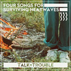
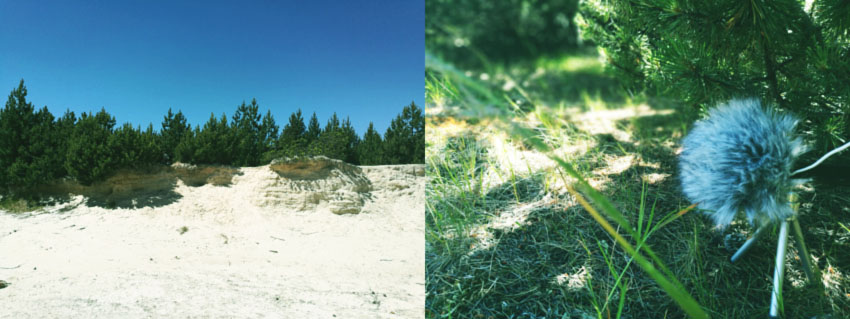

#### EXPLORING SOUND, URBAN ALIENTATION AND ENVIRONMENTAL ANXIENTY IN THE ERA OF CLIMATE BREAKDOWN
--> [LISTEN HERE](https://talkistrouble.bandcamp.com)<-- 
 

*"If we cease to listen to sounds and noises and instead listen to our bodies (the importance of which cannot be stressed too greatly), we normally grasp (hear, understand) neither the rhythms nor their associations, which nonetheless constitute us. It is only in suffering that a particular rhythm breaks apart, modified by ilness." - Henri Lefebvre, [Rhythmanalysis](https://grrrr.org/data/edu/20110509-cascone/rhythmanalysis_space_time_and.pdf)*

These simple sounds were originally recorded during extremely hot nights in June and July 2019 as an attempt to make myself tired enough to be able to fall asleep. I used a simple modular system, FM synth, sampler, sequencer and an old toy zither. Sometimes I kept the gear right next to my bed and used it till I was half asleep. Later I took the recorded material out. I played it through a loudspeaker at various places (intersection, urban wilderness, rock above a river, open pit lithium mine) and various day and night times and used a portable device to record how the replayed songs sound in an outdoor urban/nature setting during extreme heatwaves. The re-amped re-recorded sounds were then manipulated and blended with the source files using Reaper software and bunch of plugins. That’s what you are listening to right now. 

**But why did I do all this?** As I feel it, extreme heatwaves and drought that hit Europe in the last years change the way how my city sounds. It's not unimaginable - experiments by [H. Ijzerman & G.R. Semin](https://www.jstor.org/stable/40575170?seq=1#page_scan_tab_contents) based on a theory of [G. Lakoff & M. Johnson](https://www.goodreads.com/book/show/31856.Philosophy_in_the_Flesh) even suggest that temperature affects how we perceive relationships. In the end, the truth is that according to the law of physics, weather conditions can [alter the way how sound propagates through space](http://www.rane.com/pdf/eespeed.pdf). Levels of humidity and temperature affect the ability of sound to propagate by air and also the [speed of sound movement](http://www.sengpielaudio.com/calculator-airpressure.htm). Of course, you can theoretically notice the change only for some types of noise and the acoustic setting is very important. 

**So, does a city really have different sound under different weather conditions?**  Don’t trust your ears – that’s one of the golden rules of mastering engineers. Social context is powerful enough to mess with our senses and just thinking about effects of extreme weather on our perception of urban sound can probably make our brains so confused that they interpret the signals coming from ears in a biased way. I might simply be so obsessed with [environmental anxiety](https://www.apa.org/images/mental-health-climate_tcm7-215704.pdf) and irritated by the heatwaves that the world around seems to sound different although there might be no objective evidence of audible changes. It might as well just be the dizziness of my organism experiencing extreme heat that changes my perception of urban soundscapes. In any case, perception of sound changes demonstrates that [climate change](https://www.ipcc.ch/sr15/) appears as a factor of production of space. The current heatwaves drastically penetrate perceived and lived dimensions of urban space. As [Christian Schmid](http://www.mom.arq.ufmg.br/mom/babel/textos/lefebvre_space_everyday.pdf) puts it, "social space includes not only a concrete materiality but a thought concept and a feeling—an 'experience'". 

*"Sound not only influences the social, the political, the ethical; it is thanks to sound, among others, that the social, the political, and the ethical can manifest themselves."* - Marcel Cobussen, [Towards a "New" Sonic Ecology](https://cobussenma.files.wordpress.com/2018/10/cobussen-inaugural-text.pdf)

**Is this changing perception of sounds of a city a sign of a new urban alienation? And what is its real source? Is it a physical phenomenon or is it just our anxiety?** Many scholars suggest that corporations and neoliberal governments control urban space by smart use of sound. But isn't the changing perception of sonic character of a city a sign that we are losing control?

Some people choose to avoid any non-musical and personal references to make their music pure and open to a variety to interpretations. [Roland Barthes](http://www.tbook.constantvzw.org/wp-content/death_authorbarthes.pdf) notoriously called for "The Death of the Author". My idea is exactly the opposite. Can sounds recorded under certain circumstances revoke the atmosphere of a context of creation of a sound if we are given enough information on their origin? **Can a shared environmental anxiety influence the way how we listen to certain recordings?**  

**What do you hear?**

*Disclaimer: This is not an attempt to make art. It's partly experiment and partly therapy.*

**C/O:**
lakonie(X)email.cz | [talkistrouble.bandcamp.com](https://talkistrouble.bandcamp.com)

